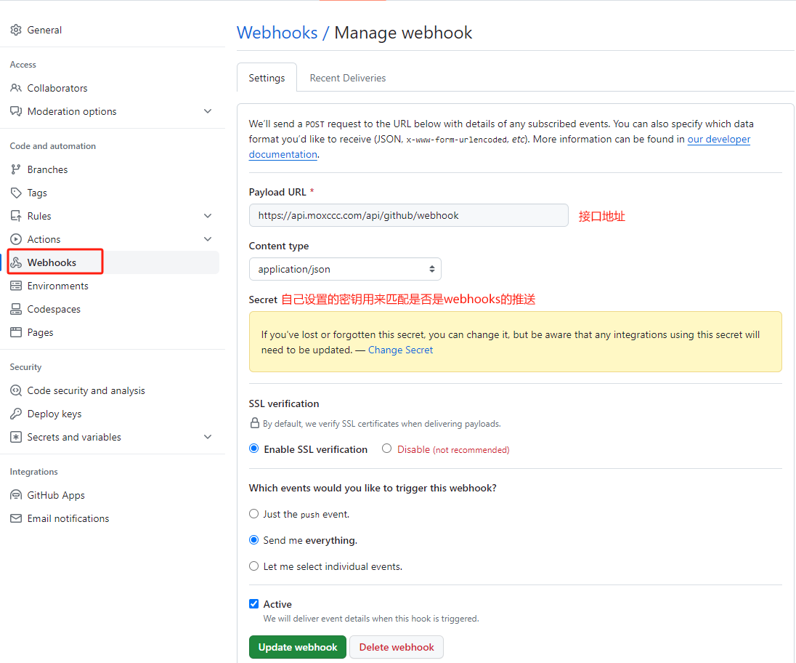

## 前言

有一天我在敲代码，网站要改几个东西，我就写完打包然后上传服务器，然后我的后端大佬说你天天手动传不累吗，我给你搞一个自动推送，一开始我还没在意，觉得这个不适用不如自己上传方便，过了一会，大佬叫我试试，我就提了一个，网站页面就自动更新了，我才发现这东西是真香呀，后面和大佬探讨了一下，就是通过github的webhooks功能，每次推送代码github就会请求你的接口，然后你在接口里处理逻辑，安装依赖、打包再移动到网站目录下，就可以实现自动刷新。后面用的非常巴适，就想着用前端代码将其实现(后端大佬用的是C#),结果就有了这篇博客，废话不多说让我们开始吧


## 配置GitHub


## 部署环境
#### Linux
首先需要一台Linux服务器，但这个写项目的都是人手一台，这里就不过多拓展了
#### Node.js
作为一个前端，写接口第一个想到的就是`node.js`，本项目也将使用`node.js`进行部署接口，那么如何在linux上安装node呢?
[这里给大家推荐个仓库，对于在linux上安装node写的很详细](https://github.com/nodesource/distributions)
> 查看是否安装成功：在linux 上输入命令 node-v 若出现 v20.10.0 则表示安装成功 

## 项目编写
1. 安装依赖包
    * body-parser：解析 HTTP 请求体的中间件。它用于处理 JSON、Raw、Text 和 URL 编码格式的数据。
    * cors：处理跨源资源共享（CORS）的中间件。CORS允许或拒绝来自不同源的 web 应用对你的服务器资源的访问。
    * express：提供了一套丰富的功能用于开发 web 和移动应用程序。
    ```node
        npm install body-parser cors express --save
    ```
2. 在项目文件下 新建 `app.js` 用来启动服务
```
//app.js

const express = require('express')
const bodyParser = require('body-parser')
const app = express()

app.use(require('cors')())
app.use(express.json())

//使用body-parser中间件
app.use(
  bodyParser.urlencoded({
    extended: false
  })
)
app.use(bodyParser.json())

app.listen(8080, () => {
  console.log('服务启动成功')
})

```
1. 在项目文件下 新建 `router\api\github.js` 用来写接口
```
//github.js

const crypto = require('crypto'); //用来破解github webhook的密钥

const { exec } = require('child_process');; //使用linux命令
const util = require('util');
const execAsync = util.promisify(exec); //解决exec的回调地狱
const fs = require('fs'); //文件系统操作

/**
* @swagger
* /api/github/webhook:
*   post:
*     summary: 本地项目上传github自动打包覆盖网页代码
*     tags: [GitHub]
*     responses:
*       200:
*         description: Success
*         content:
*           application/json:
*             schema:
*               type: object
*               properties:
*                 message:
*                   type: string
*                   description: 提示消息
*/

exports.gitVueHook = async function (req, res) {
  // 从请求头中获取签名
  const signature = req.headers['x-hub-signature-256'];
  if (!signature) {
    return res.status(403).send({ message: "未授权访问" });
  }

  const secret = 'XXXXX'; //此处则是你在github webhooks设置的Secret
  const payload = JSON.stringify(req.body);
  const hash = `sha256=${crypto.createHmac('sha256', secret).update(payload).digest('hex')}`;
  if (!crypto.timingSafeEqual(Buffer.from(hash), Buffer.from(signature))) {
    return res.status(401).json({ message: "签名不匹配" });
  }
  
  //此处代表签名匹配成功
  try {
    const message = await deleteAndCloneRepository();
    res.status(200).json({ message });
  } catch (error) {
    res.status(500).json({ message: '无法更新或克隆仓库。' });
  }

}

const REPO_URL = 'https://github.com/moxccc/githook.git'; // 你的仓库 URL
const REPO_PATH = `/var/git/githook`; // 设置仓库路径
const MOVE_PATH = '/var/www/preview'; // 设置移动的路径

// 异步删除目录并克隆仓库 --需要npm 的项目
const deleteAndCloneRepository = async function () {
    try {
        // 检查是否已经是一个 Git 仓库
        if (fs.existsSync(`${REPO_PATH}/.git`)) {
            // 仓库已存在，执行 git pull
            await execAsync('git pull', { cwd: REPO_PATH });
        } else {
            // 仓库不存在，执行 git clone
            await execAsync(`git clone ${REPO_URL} ${REPO_PATH}`);
        }
        // 执行 npm install 更新依赖
        await execAsync('npm install', { cwd: REPO_PATH });

        // 执行 npm run build 打包
        await execAsync('npm run build', { cwd: REPO_PATH });

        // 移动 dist 文件夹
        const sourcePath = `${REPO_PATH}/dist`;
        await execAsync(`rm -rf ${MOVE_PATH} && mv ${sourcePath} ${MOVE_PATH}`);

        return '仓库操作、依赖安装及文件移动完成。';
    } catch (error) {
        console.error('操作过程中出错:', error);
        throw error;
    }
}

```
写完后在app.js引入接口
```
//app.js

// 引入数据api
const github = require('./router/api/github')

// 使用router中间件
app.post('/api/github/webhook', (req, res) => {
  github.gitVueHook(req, res)
});
```
设置开机自启，不理解的可以看我的另一篇文章 
```
cd  /etc/systemd/system/ 
touch node.service
vi node.service

//node.service内容如下：

[Unit]
Description=subconverter

[Service]
WorkingDirectory=/usr/web
ExecStart=node app.js
Restart=always
RestartSec=3 
SyslogIdentifier=dotnet-example
User=root

[Install]
WantedBy=multi-user.target

//设置开启自启且立即启动
systemctl enable node.service –now
```
若要查看node.service的日志，则输入以下命令
```
journalctl -u node.service -e -f

-u: 只显示与特定服务相关的日志
-e: 滚动底部
-f: 有新的日志时，立即显示在屏幕上
```


上面`@swagger` 是一个swagger接口文档注释，感兴趣的话可以看一下我的[swagger教程](#额外篇-Swagger)

到这里接口就部署成功，我觉得大功告成了,此时我的心情是这样的
大佬问我做完没，我自信满满的说做完了，大佬说如果我给你发了多个请求你接口会怎么样，我当时想着都是我自己提交而且也就多发了几个请求嘛应该能扛得住，我就说没事，大佬叫我加个异步队列，我想着发就发嘛，总不能崩掉吧就没加，后来大佬测试了一下直接G了，然后就被喷了个体无完肤，现在我的心情是这样的

一番交流下来也暴露我这项目的几个缺点
*   项目接口返回慢，因为要全部完成才能返回状态码，基本上要3 ~ 4s
*   如果一个人重复提交会导致项目崩溃，可能公司的项目也不会有人这样做，但是万一呢，你可以保证你自己，那其他人呢( 狗头保命 )


## Redis
我大抵是想进步了，躺在床上横竖睡不着，坐起来静静地看着窗外，这悲伤没由得来，黯然的看着电脑上的项目，一个报错的是我的，另一个报错的也是我的。不行，怎么能被这个小东西难住了，然后就开始了我的虚心求教之路，为了解决以上两个问题，和大佬深入交流了一下，考虑了kafka、rabbitmq和redis大佬还是觉得用Redis好，因为redis部署简单，且自用项目也没有太多需要处理的消息，确定下来后就开始了我的优化之旅，下面给大家看一张大佬发我的这几个的对比图


1. 安装redis
```
//linux 安装
apt install redis-server
//输入命令redis-cli ping 若提示PONG 则表示安装成功

//node 安装
npm install redis
```

2. 使用redis
```
//github.js

// redis 异步队列
const redis = require('redis');
const publisher = redis.createClient(); //发送者
const subscriber = redis.createClient(); //订阅者

exports.gitVueHook = async function (req, res) {

  <!-- 其他代码 -->
  
  //在验证签名成功后给队列发送消息
  // 获取提交人信息
  const data = req.body;
  // 仓库名称
  const depotName = data.repository?.name;
  // 消息队列所需数据 
  const taskData = { depotName };

  // 发布任务
  publisher.publish('githooks', JSON.stringify(taskData), (err) => {
    if (err) {
      console.error('发布消息时出错:', err);
      return res.status(500).send({ message: "内部服务器错误" });
    }
    res.status(200).json({ message: "ok" });
  });
}

//订阅者
subscriber.on('message', (channel, message) => {
    deleteAndCloneRepository()
  });
  
subscriber.subscribe('githooks');

```
3. 如果你的项目使用redis比较少可以将 订阅/发布写在一起，如果使用redis的地方比较多的话，我建议是将订阅单独拎出来，防止代码复杂化，若单独写的话你的订阅事件里包含了一个` deleteAndCloneRepository `方法，所以首先要把这个` deleteAndCloneRepository `方法单独写成一个js文件，(如果嫌麻烦也可以在gihook.js里将这个方法放出来)
* 新建`utils\redis\repositoryActions.js`文件 
```
//repositoryActions.js

const { exec } = require('child_process'); //使用linux命令
const util = require('util');
const execAsync = util.promisify(exec);
const fs = require('fs');

// 异步删除目录并克隆仓库
const deleteAndCloneRepository = async function (REPO_PATH, REPO_URL, MOVE_PATH) {
    try {
        // 检查是否已经是一个 Git 仓库
        if (fs.existsSync(`${REPO_PATH}/.git`)) {
            // 仓库已存在，执行 git pull
            await execAsync('git pull', { cwd: REPO_PATH });
        } else {
            // 仓库不存在，执行 git clone
            await execAsync(`git clone ${REPO_URL} ${REPO_PATH}`);
        }
        // 执行 npm install 更新依赖
        await execAsync('npm install', { cwd: REPO_PATH });

        // 执行 npm run build 打包
        await execAsync('npm run build', { cwd: REPO_PATH });

        // 移动 dist 文件夹
        const sourcePath = `${REPO_PATH}/dist`;
        await execAsync(`rm -rf ${MOVE_PATH} && mv ${sourcePath} ${MOVE_PATH}`);

        return '仓库操作、依赖安装及文件移动完成。';
    } catch (error) {
        console.error('操作过程中出错:', error);
        throw error;
    }
}
module.exports ={
    deleteAndCloneRepository,
}
```
* 新建`utils\redis\index.js`文件 更改订阅者` deleteAndCloneRepository `方法的引用
```
const redis = require('redis');
const subscriber = redis.createClient(); // 确保这个是全局的或者在合适的地方初始化

const {deleteAndCloneRepository} = require('./repositoryActions'); // 引入你的异步删除和克隆仓库函数

subscriber.on('message', (channel, message) => {
    const task = JSON.parse(message);
    let REPO_URL = 'https://github.com/moxccc/githook.git'; // 你的仓库 URL
    let REPO_PATH = `/var/git/${task.depotName}`; // 设置仓库路径
    let MOVE_PATH = '/var/www/githubpreview'; // 设置移动的路径
    deleteAndCloneRepository(REPO_PATH, REPO_URL, MOVE_PATH)
  });
  
  subscriber.subscribe('githooks');
```
* `utils\redis\index.js`是一个单独的js文件 需要使用node index.js 命令启动，为了便捷，我们将它也设置为开机自启
```
cd  /etc/systemd/system/ 
touch node-redis.service
vi node-redis.service

//node-redis.service内容如下：

[Unit]
Description=node_redis

[Service]
WorkingDirectory=/usr/web/utils/redis
ExecStart=node index.js
Restart=always
RestartSec=3 
SyslogIdentifier=dotnet-example
User=root

[Install]
WantedBy=multi-user.target

//设置开启自启且立即启动
systemctl enable node-redis.service –now
```


设置redis后，上面的两个问题都被解决了，现在访问接口，耗时只有1.2s左右了，到这里项目就部署完毕，觉得对你有帮助的可以关注我，博客不定时更新，有问题可以在下方留言。对了，后端大佬的博客在我友链，感兴趣的可以关注一下



## 额外篇-Swagger
[Swagger](https://swagger.io/tools/swagger-ui/)是一种用于设计、构建和记录 RESTful API 的开发工具和规范。它的主要目标是帮助开发团队更轻松地设计、测试和文档化 API，以便开发人员、测试人员和其他利益相关者可以更好地理解和使用 API。

下面给大家介绍如何在node中使用[Swagger](https://swagger.io/tools/swagger-ui/)
1. 安装依赖
```
npm install swagger-jsdoc swagger-ui-express --save
```
2. 新建文件 `utils\swagger\index.js`
```
const path = require('path')
const swaggerJsdoc = require('swagger-jsdoc');
const swaggerUi = require('swagger-ui-express');

// Swagger定义
const swaggerDefinition = {
  openapi: '3.0.0',
  info: {
    title: 'moxccc Swagger',
    version: '1.0.0',
  },
};

// 选项配置
const options = {
  swaggerDefinition,
  // 写入API文件的路径
  apis: [path.join(__dirname,'../../router/api/*.js')],
};

const swaggerSpec = swaggerJsdoc(options);

// 导出一个函数，该函数接收应用程序实例并应用Swagger配置
function setupSwagger(app) {
  app.use('/Swagger/index.html', swaggerUi.serve, swaggerUi.setup(swaggerSpec));
}

module.exports = setupSwagger;
```
3. 在`app.js`里引用
```
// 引入封装的Swagger配置
const setupSwagger = require('./utils/swagger'); 
// 使用封装的Swagger配置
setupSwagger(app);
```
4. 在接口里引入注释
```
//github.js

/**
* @swagger
* /api/github/webhook:
*   post:
*     summary: 本地项目上传github自动打包覆盖网页代码
*     tags: [GitHub]
*     responses:
*       200:
*         description: Success
*         content:
*           application/json:
*             schema:
*               type: object
*               properties:
*                 message:
*                   type: string
*                   description: 提示消息
*/
```


重新启动服务 systemctl restart node.service  访问` https://网址/Swagger/index.html ` 即可查看


## 额外篇-接入企业微信机器人
若是公司项目，可接入企业微信机器人用来发送提示信息，例如：xxx于xxx时间提交了代码，提交信息为xxx
1. 安装axios
```
npm install axios -S
```
2. 新建文件` utils\apireq\index.js` 用于封装机器人发送接口
```
const axios = require('axios');

async function sendWeChatMessage(content) {
    const webhookUrl = 'xxx';//机器人请求连接
    const message = {
        msgtype: 'markdown',
        markdown: {
            content: content
        }
    };

    try {
        const response = await axios.post(webhookUrl, message);
        console.log('消息发送成功:', response.data);
    } catch (error) {
        console.error('发送消息时发生错误:', error);
    }
}
module.exports = sendWeChatMessage;
```
3. 在项目中使用
```
// 引入机器人
const sendWeChatMessage = require('../apireq/index.js');

//发送消息
sendWeChatMessage(`【Git】Hot Reload Success`)
```
