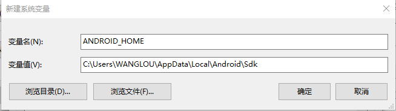
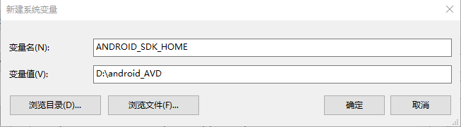
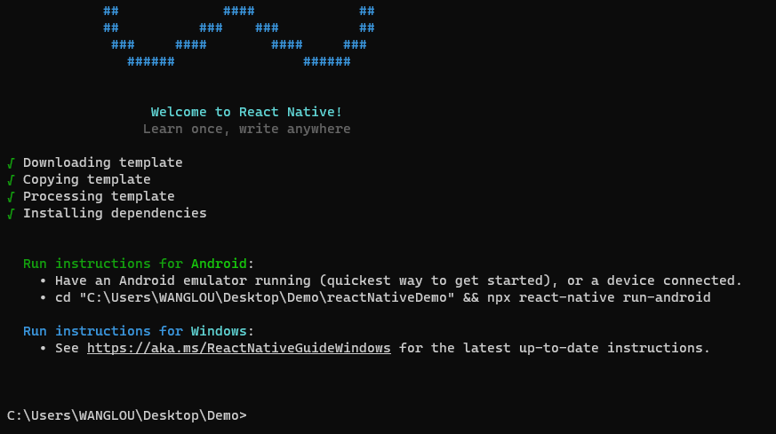
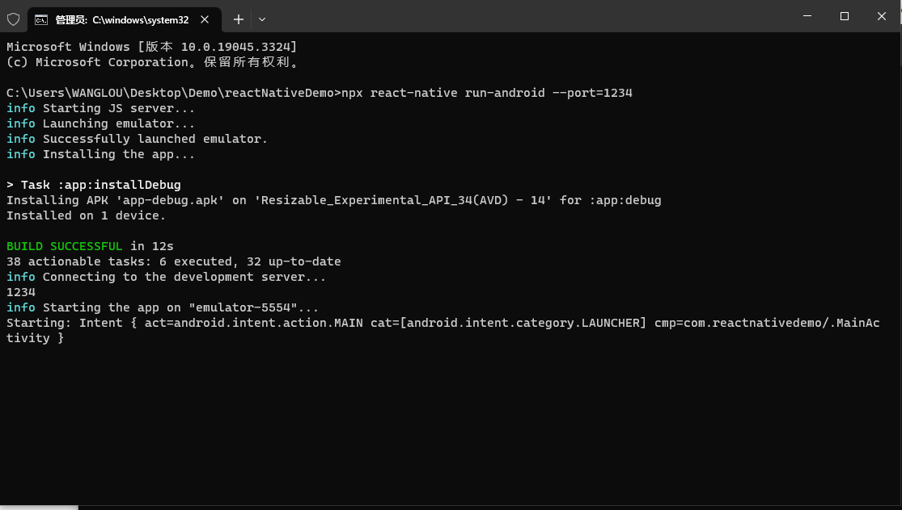
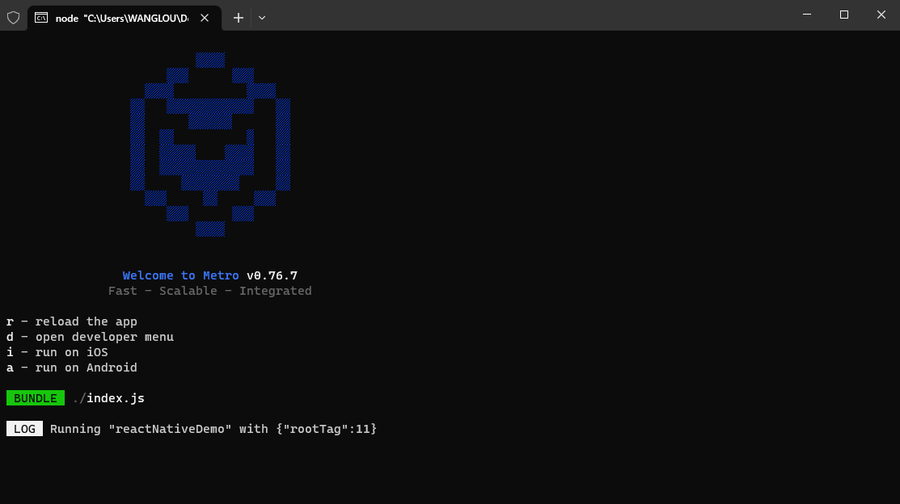
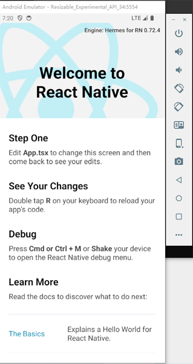

## 前言

[React Native](https://reactnative.dev/) 是一个使用 JavaScript 和 React 开发本地Android和iOS应用的框架，他有以下优点: 
* **简单易开发**
React Native 使你可以创建真正原生的应用，用户体验绝不拉胯。它提供了一些平台无关的抽象核心组件，像是`View`, `Text` 以及 `Image`等，可直接映射渲染为 对应平台的原生UI组件。

* **无缝跨平台**
通过 React 的声明式组件机制和 JavaScript 代码，现有的原生代码和api可以完美地封装嵌合到 React 组件中。这样既为更多新的开发团队赋予原生应用的开发能力，也能极大地提升现有原生团队的开发效率。

* **秒速刷新**
保存即刷新  借助 JavaScript 的动态特性， React Native 能够让你光速迭代。



## 搭建开发环境

React Native有三个开发平台 macOS、Windows Liunx

### Android

#### 首先你需要在你的电脑上先安装 [Node](https://nodejs.org/en)、[JDK](https://www.oracle.com/java/technologies/downloads/#java11)和[Android Studio](https://developer.android.com/studio)这些项目依赖后才能进行React Native项目的创建

注意事项：
* Node 的版本应大于等于 16，安装完 Node 后建议设置 npm 镜像（淘宝源）以加速后面的过程
* 不要使用 cnpm！cnpm 安装的模块路径比较奇怪，packager 不能正常识别！
* React Native 需要 `Java Development Kit [JDK] 11`,你可以在命令行中输入 `javac -version`来查看你当前安装的 JDK 版本。如果版本不合要求，则可以去[Temurin](https://adoptium.net/zh-CN/temurin/releases/?variant=openjdk11&jvmVariant=hotspot)或[Oracle JDK](https://www.oracle.com/java/technologies/downloads/#java11)上下载


#### 配置环境变量
React Native 需要通过环境变量来了解你的 Android SDK 装在什么路径，从而正常进行编译。
* 右键`我的电脑`>`属性`>`高级系统设置`>`高级`>`环境变量`>`新建`,创建一个名为ANDROID_HOME的环境变量（系统或用户变量均可），指向你的 Android SDK 所在的目录（具体的路径可能和下图不一致，请自行确认）：



* 使用Android Studio 时需要安装模拟器，但是坑人的是他的模拟器只能安装在`C盘`里面，安装完成后大概能占个5G的存储空间,如果你不想当`C盘战士`的话就得将他移到别的空闲的磁盘中,这时我们可以定义一个系统变量来改变它的默认路径指向



>我这里是将它的默认路径改在了`D:\android_AVD`文件夹中,你如果想装在其他的盘中，把变量值改成你文件夹的对应路径即可

#### 创建新项目

1. 准备工作做完后可以开始创建React Native项目了在你项目文件夹中打开命令提示框 输入 
`npx react-native@latest init 项目名称`

注意事项：
* 如果你之前全局安装过旧的`react-native-cli`命令行工具，请使用`npm uninstall -g react-native-cli`卸载掉它以避免一些冲突：
```
npm uninstall -g react-native-cli @react-native-community/cli
```

* 文件名中不能使用`中文`、`空格`等特殊符号。也不能使用常见的关键字作为项目名（如 `class`, `native`, `new`, `package` 等等）。也不能使用与核心模块同名的项目名（如 `react`, `react-native` 等）。



2.安装成功后的界面应该是这样的



3.接下来就可以启动项目了
```BASH
# 进入你的项目
cd AwesomeProject

# 运行
npx react-native run-android

# 运行完后会打开一个新的命令提示框并显示4个选项

r - reload the app
d - open developer menu
i - run on iOS
a - run on Android 

Android 输入 a 即可

```





若启动不成功可能是端口被占用，只需要修改端口号即可

```
npx react-native run-android --port=1234
```



### iOS

待填充


