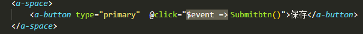
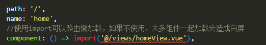

## 介绍

  为什么写这样一篇文章呢，说到底是被折磨的受不了了，每次创建项目，东西还没怎么写就这报错那报错，烦的一批。所以呢趁着有时间赶紧把这些问题都给它集中起来，以后遇到直接看就行了，不用东搜西搜浪费时间！

## 开始
### 1. VsCode 写方法出现  ` @event=> `

 在 Vue 中的点击事件 @click 后会自动补全一段“ `$event =>` ”，这是 VSCode 中setting.json未设置好的缘故

 
***解决方案***
> 点击设置-扩展-Inlay Hints: Event Argument In Inline Handlers 把他的勾选取消即可

### 2. vue文件引入正确 却出现红色错误波浪线
在 Vue 文件中，引入外部文件不管你正确不正确都会出现红色的波浪线，产生这个问题的原因是我们使用了ts语法，他只能识别.ts文件，并不能识别.vue文件，所以在引入组件的时候报错了



***解决方案***

``` js
//在 vite-env.d.ts 添加如下代码

declare module "*.vue" {
    import { App, defineComponent } from "vue";
    const component: ReturnType<typeof defineComponent> & {
        install(app: App): void;
    };
    export default component;
}
```
### 2. vue文件引入 " `@/store` " 出现红色波浪线
找不到模块“@/…”或其相应的类型声明

***解决方案***

``` js
//在 tsconfig.json 中添加配置
"baseUrl": "./",// 解析非相对模块的基础地址，默认是当前目录
    "paths": {
    // 路径映射，相对于baseUrl
      "@/*":["src/*"]
    }
```


